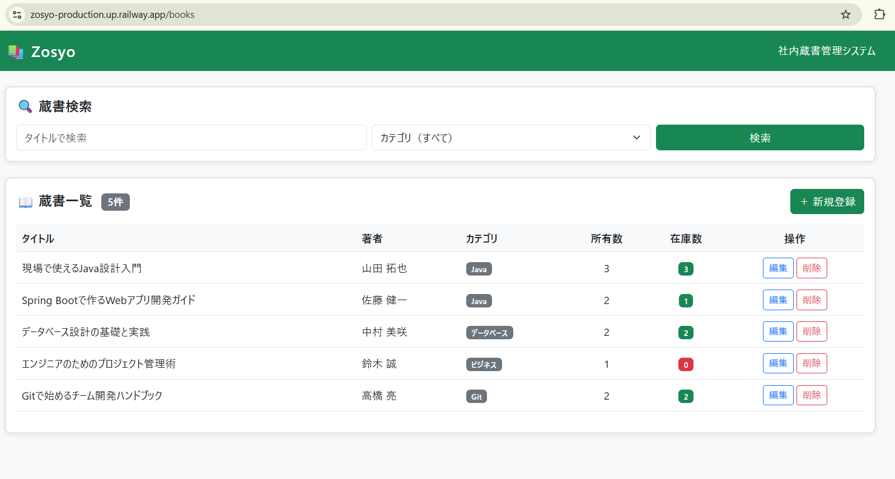
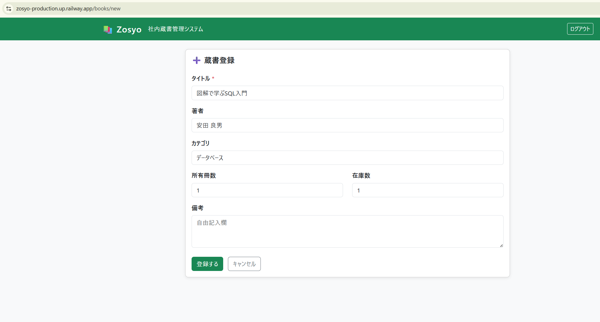
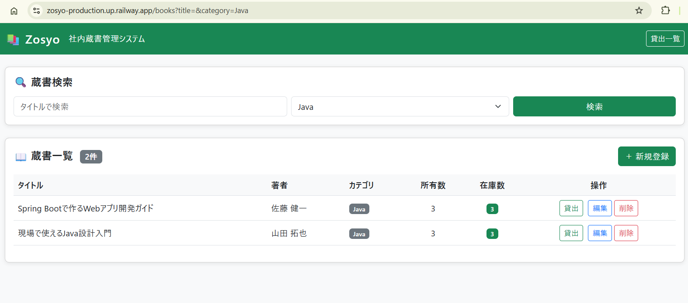

# Zosyo（蔵書）- 社内蔵書管理システム

[](https://openjdk.org/projects/jdk/21/)
[](https://spring.io/projects/spring-boot)
[](https://www.postgresql.org/)
[](https://railway.app/)
[](https://opensource.org/licenses/MIT)

> 前職の業務課題をシステム化した、Spring Boot + PostgreSQL による社内蔵書管理Webアプリケーション。  
> Railway にデプロイ済みで、すぐに動作確認できます。

<a href="https://zosyo-production.up.railway.app/books" target="_blank">
  デモURL：https://zosyo-production.up.railway.app/books
</a>

---

## 制作の背景・動機

前職（事務員）では、会社が購入した技術書・ビジネス書の管理をExcelで行っていました。  
在庫数の更新漏れ・書籍の所在不明・貸出記録の散逸といった問題が日常的に発生しており、  
「これはシステム化すべき業務だ」と感じた実体験がこのプロジェクトの出発点です。

Javaを学び始めたタイミングで、**学習の成果を実務課題の解決に繋げる**ことを目標に開発しました。

---

## デモ画面

### 蔵書一覧



### 蔵書登録



### 検索結果（カテゴリ絞り込み）



---

## 使用技術

| 分類           | 技術                                                       |
| -------------- | ---------------------------------------------------------- |
| バックエンド   | Java 21 / Spring Boot 4.0.6 / Spring MVC / Spring Data JPA |
| フロントエンド | Thymeleaf / HTML / CSS / Bootstrap 5                       |
| データベース   | PostgreSQL 16                                              |
| インフラ       | Railway（Serverless構成）                                  |
| バージョン管理 | Git / GitHub                                               |
| ビルドツール   | Maven                                                      |
| コンテナ       | Docker                                                     |

---

## システム構成

```
[ユーザーのブラウザ]
       │ HTTPS
       ▼
[Railway - Spring Boot アプリ]  ←── GitHub push で自動デプロイ
       │ JDBC
       ▼
[Railway - PostgreSQL 16]
```

- **デプロイ方式：** GitHub連携による自動デプロイ（push → ビルド → リリース）
- **スケーリング：** Serverless設定（アイドル時はリソースを解放）
- **環境変数：** DB接続情報はRailway環境変数で管理（コードにハードコードなし）

---

## 機能一覧

| 機能         | 説明                                                     |
| ------------ | -------------------------------------------------------- |
| 蔵書一覧表示 | 登録された全書籍の一覧表示                               |
| 蔵書登録     | タイトル・著者・カテゴリ・冊数などの新規登録             |
| 蔵書編集     | 既存書籍情報の更新                                       |
| 蔵書削除     | 書籍レコードの削除                                       |
| 検索         | タイトル・カテゴリによる絞り込み検索                     |
| 在庫表示     | 在庫あり（緑色表示）/ 在庫なし（赤色表示）で視覚的に判別 |

---

## ER図

```
books
  ├── id          BIGSERIAL     PRIMARY KEY
  ├── title       VARCHAR(200)  NOT NULL        （書籍タイトル）
  ├── author      VARCHAR(100)                  （著者名）
  ├── category    VARCHAR(50)                   （カテゴリ）
  ├── quantity    INT           NOT NULL DEFAULT 1  （総冊数）
  ├── stock       INT           NOT NULL DEFAULT 1  （在庫数）
  ├── note        VARCHAR(255)                  （備考）
  ├── created_at  TIMESTAMP                     （登録日時）
  └── updated_at  TIMESTAMP                     （更新日時）
```

---

## ローカル起動手順

### 前提条件

- Java 21 以上
- Maven 3.9 以上
- PostgreSQL 16 以上

### 手順

```bash
# 1. リポジトリのクローン
git clone https://github.com/akito256a/zosyo.git
cd zosyo

# 2. DBの作成（PostgreSQL）
createdb zosyo_db

# 3. application.properties の設定
#    src/main/resources/application.properties を編集
#    spring.datasource.url / username / password を自環境に合わせる

# 4. 起動
./mvnw spring-boot:run

# 5. ブラウザでアクセス
open http://localhost:8080/books
```

---

## ディレクトリ構成

```
zosyo/
├── src/
│   ├── main/
│   │   ├── java/com/zosyo/
│   │   │   ├── controller/   # MVCコントローラー
│   │   │   ├── model/        # エンティティクラス
│   │   │   ├── repository/   # Spring Data JPA リポジトリ
│   │   │   └── service/      # ビジネスロジック
│   │   └── resources/
│   │       ├── templates/    # Thymeleafテンプレート
│   │       └── application.properties
├── Dockerfile
├── railway.toml
└── pom.xml
```

---

## 今後の拡張予定

- [x] 貸出・返却機能（貸出者・返却期限の管理）
- [ ] Spring Security によるログイン認証
- [ ] CSVエクスポート機能
- [ ] REST API化（フロントエンド分離を想定）
- [ ] React / TypeScript によるフロントエンド刷新

---

## 開発者について

事務職からWebエンジニアへのキャリアチェンジを目指して学習中です。  
前職での業務経験を活かし、「課題をシステムで解決する」視点を大切にしています。
また、UI/UXにこだわった、アプリを「迷わず使える」設計を目指しています。

- GitHub：[@akito256a](https://github.com/akito256a)

---

## ライセンス

[MIT License](./LICENSE)
